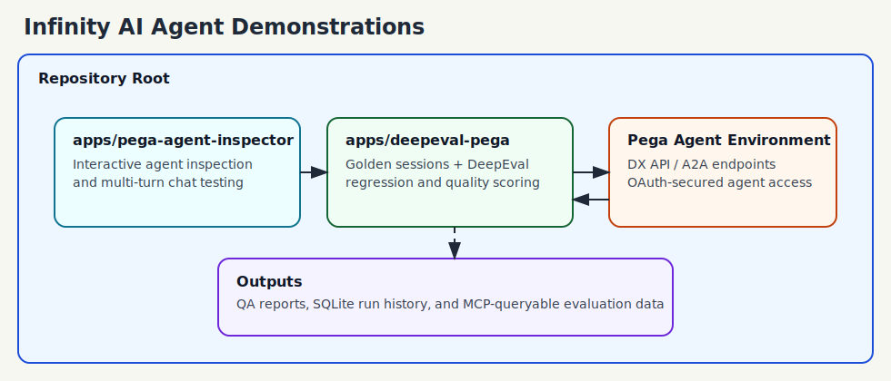

# Infinity AI Agent Demonstrations

This repository contains two complementary applications for working with Pega AI agents:

- **Pega Agent Inspector**: inspect agent configuration and chat with agents interactively.
- **DeepEval Pega**: run repeatable quality and regression evaluations against those agents.

Together, they support a practical workflow:

1. Explore and validate an agent interactively.
2. Capture golden conversations.
3. Run automated regression and quality checks over time.

## Getting Started in 5 Minutes

1. Install prerequisites: Python 3.11+ and Node.js 18+.
2. Start the inspector app:

```bash
cd apps/pega-agent-inspector
npm install
npm start
```

3. In another terminal, start the evaluation app:

```bash
cd apps/deepeval-pega
python -m venv .venv
source .venv/bin/activate
pip install -r requirements.txt
cp .env.example .env
python create_db.py
reflex run
```

4. Open both apps in your browser:
  - Inspector: `http://localhost:3000`
  - DeepEval UI: `http://localhost:3000`
  - If running both at once, start Inspector on a different port (example: `PORT=3002 npm start`).
5. Use Inspector to validate agent behavior, then run a regression in DeepEval with a golden dataset.

## Repository Architecture (High Level)



## Repository Structure

```text
apps/
  deepeval-pega/
  pega-agent-inspector/
docs/
scenarios/
scripts/
```

# Applications

## DeepEval Pega

Location: [apps/deepeval-pega](apps/deepeval-pega)

DeepEval Pega is a project-agnostic evaluation framework for Pega AI agents. It uses DeepEval plus a pluggable LLM judge (Gemini, Bedrock, OpenAI, or GitHub Copilot) to score conversation quality and detect regressions.

### What it provides

- Reflex web app for:
  - project configuration management
  - golden dataset creation and management
  - metric selection and evaluation runs
  - REST API management
- FastAPI REST API for programmatic access to:
  - projects
  - datasets
  - evaluations
  - LLM profiles
- Golden-session capture and replay tooling
- 13 automated conversational/regression tests (quality, latency, tool usage, case lifecycle, bias/toxicity, and more)
- SQLite result persistence and an MCP server for querying QA outcomes

### Core tech

- Python (3.11+)
- Reflex
- FastAPI
- DeepEval
- pytest
- SQLite

### Quick start

```bash
cd apps/deepeval-pega
python -m venv .venv
source .venv/bin/activate
pip install -r requirements.txt
cp .env.example .env
python create_db.py
reflex run
```

Then open:

- UI: `http://localhost:3000`
- Reflex backend: `http://localhost:8000` (default)

For API use:

```bash
python run_api.py
```

Open API docs at `http://localhost:8100/docs`.

### Read more

- Full setup and usage: [apps/deepeval-pega/README.md](apps/deepeval-pega/README.md)
- Project decisions: [apps/deepeval-pega/Decisions.md](apps/deepeval-pega/Decisions.md)
- Regression notes: [apps/deepeval-pega/RegressionNeeds.md](apps/deepeval-pega/RegressionNeeds.md)

## Pega Agent Inspector

Location: [apps/pega-agent-inspector](apps/pega-agent-inspector)

Pega Agent Inspector is a developer utility for inspecting and interactively testing Pega AI agents through an Express proxy. The browser never calls Pega directly.

### What it provides

- Configuration panel for Pega connection + OAuth details
- Agent inspection panel showing:
  - model and prompt configuration
  - tool metadata
  - SVG dependency graph
  - request history
- Live multi-turn chat panel
- Support for two protocols:
  - Pega DX API (`API` mode)
  - Agent-to-Agent JSON-RPC (`A2A` mode)

### Core tech

- Node.js 18+
- Express
- Plain HTML/CSS/JavaScript frontend (no bundler)

### Quick start

```bash
cd apps/pega-agent-inspector
npm install
npm start
```

Development mode:

```bash
npm run dev
```

Open `http://localhost:3000` and configure your Pega endpoint, OAuth token URL, credentials, and agent target.

### Read more

- Full setup and usage: [apps/pega-agent-inspector/README.md](apps/pega-agent-inspector/README.md)

## How These Apps Fit Together

Recommended workflow for teams:

1. Use [apps/pega-agent-inspector](apps/pega-agent-inspector) to inspect prompts, tools, and behavior while iterating.
2. Capture representative conversations and create golden datasets in [apps/deepeval-pega](apps/deepeval-pega).
3. Run DeepEval regression suites after agent, prompt, or tool changes.
4. Track and query quality trends using the generated reports and SQLite/MCP pipeline.

## Prerequisites (Combined)

- Python 3.11+ (for DeepEval Pega)
- Node.js 18+ (for Pega Agent Inspector and Reflex frontend build)
- Access to a Pega environment with OAuth2 client credentials
- At least one LLM provider credential for DeepEval judging:
  - Google Gemini, OpenAI, AWS Bedrock, or GitHub Copilot

## Scripts

### `scripts/sync-subtrees.sh`

Synchronizes both app subtrees from their dedicated remotes into this monorepo, then pushes the result.

What it does:

1. Pulls latest `main` from remote `pega-agent-inspector` into `apps/pega-agent-inspector` (squashed subtree update).
2. Pulls latest `main` from remote `deepeval-pega` into `apps/deepeval-pega` (squashed subtree update).
3. Pushes updated branch to `origin`.

Run from repository root:

```bash
bash scripts/sync-subtrees.sh
```

Requirements:

- Git remotes named `pega-agent-inspector` and `deepeval-pega` must be configured.
- You must have push access to `origin`.

## Notes

- The applications are independent but complementary.
- Each app has its own runtime, dependencies, and configuration.
- Both apps default to `localhost:3000`; run one at a time or change the inspector port via `PORT` when running together.
- For environment variables and provider-specific setup, use each app’s README.
