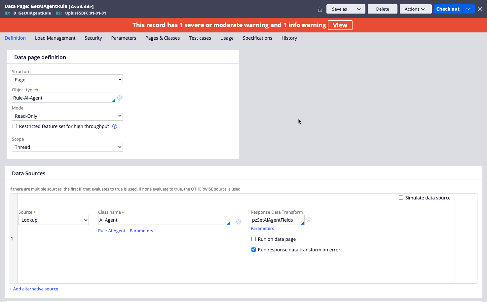

# Pega Agent Inspector

A developer utility for inspecting and interactively testing Pega AI agents. The tool surfaces agent configuration (model, prompts, tools) from the Pega DX API and provides a live chat interface — all without touching the Pega platform directly from the browser.

## What it does

The application has three side-by-side panels:

| Panel | Purpose |
|---|---|
| **Configuration** | Enter Pega connection details, OAuth credentials, and which agent to target |
| **Agent Inspection** | Fetch and display full agent metadata: model config, prompts, examples, tools, and an SVG dependency graph |
| **Agent Interaction** | Hold a live multi-turn conversation with the agent |

Two agent protocols are supported:

- **API** — Uses the Pega DX API (`/api/application/v2/ai-agents/…`). Requires a base application URL and an Agent ID in the form `AppliesTo!RuleName` (e.g. `@BASECLASS!MyAgentRule`).
- **A2A** — Uses the Agent-to-Agent spec (v0.3 JSON-RPC 2.0). Requires only the agent's `.well-known/agent.json` card URL; the base URL and agent identity are parsed from it automatically.

## How it works

### Architecture

The app is a **stateless Express proxy**. The browser never calls Pega directly — all credentials and Pega API calls are forwarded through the Express backend on each request. Nothing is persisted server-side.

```
Browser (fetch) → Express route → lib/ class → Pega API
                                              ↓
Browser          ← Express route ← lib/ class ←
```

### Request flow

1. **Authenticate** — The browser POSTs OAuth credentials to `/api/auth/token`. The backend exchanges them for a bearer token via the `client_credentials` grant and returns it to the browser.
2. **Inspect** — The browser POSTs the token and agent identity to `/api/agent/info`. The backend calls the Pega `D_GetAIAgentRule` data view (and the A2A agent card in parallel for A2A mode) and returns normalized agent metadata.
3. **Chat** — Each message is POSTed to `/api/chat/send`. The backend manages the Pega conversation lifecycle (initiating a new conversation on the first message for the API protocol; threading `contextId` for A2A) and returns the agent's reply.

### Backend (`src/`)

| File | Responsibility |
|---|---|
| `server.js` | Express app setup — security headers, CORS, logging, static files, route mounting |
| `config.js` | Port, environment, and CORS origin (from env vars or defaults) |
| `routes/auth.js` | `POST /api/auth/token` — proxies the OAuth token request |
| `routes/agent.js` | `POST /api/agent/info` — fetches and normalizes agent metadata |
| `routes/agentcard.js` | `POST /api/agentcard/fetch` — fetches an A2A agent card |
| `routes/chat.js` | `POST /api/chat/send`, `POST /api/chat/new` — proxies chat messages |
| `lib/PegaAuth.js` | OAuth 2.0 client credentials token exchange |
| `lib/PegaDXApi.js` | Pega DX API client — agent info lookup, conversation initiation, message sending, response normalization |
| `lib/A2AHandler.js` | A2A spec 0.3 client — agent card fetching, JSON-RPC 2.0 `message/send` |
| `lib/ApiChatHandler.js` | Orchestrates the API-protocol chat flow (initiate then send) |

### Frontend (`public/`)

Plain HTML, CSS, and JavaScript — no bundler, no transpilation. Modules communicate through `window.*` globals. Load order in `index.html` is significant:

```
api-client.js → config-panel.js → inspector-panel.js → chat-panel.js → app.js
```

| File | Responsibility |
|---|---|
| `api-client.js` | Thin fetch wrapper for all backend API calls |
| `config-panel.js` | Configuration form; protocol toggle; input validation |
| `inspector-panel.js` | Fetches agent info; renders metadata sections, SVG tool graph, and request history log |
| `chat-panel.js` | Chat UI; manages conversation state; renders message bubbles |
| `app.js` | Initializes all panels, wires cross-panel references, manages light/dark theme |

### Inspector panel details

After a successful agent info fetch, the inspector renders:

- **SVG visualization** — A three-column graph showing the agent node → tool type nodes (Case Types, Knowledge, Agent Tools, External Agents, MCP Clients) → individual tool leaf nodes, colour-coded by category.
- **Agent metadata** — Name, description, rule name, class name, coach mode, external access status.
- **Model configuration** — Provider, model name, and model ID.
- **Prompts** — User Prompt, Initial Instructions, System Prompt, Response Style, and Guardrails, each in a collapsible section.
- **Examples** — Numbered list of configured few-shot examples.
- **Tool groups** — Each tool shows its name, category, availability, confirmation requirement, and protocol badge.
- **Request history log** — Every API call made during the session (token fetch, agent info, each chat message) with method, endpoint, HTTP status, duration, and expandable request/response JSON with a copy button.

### Token lifecycle

The access token is acquired once when the user clicks **Get Agent Information** and held in `InspectorPanel` module scope. The Chat panel reads it via `InspectorPanel.getAccessToken()`. A 401 from a chat call surfaces as an error bubble in the chat; the user re-authenticates by clicking the button again.

## Prerequisites

- **Node.js 18 or later** (the app uses the built-in `fetch` API — no polyfill required)
- A reachable Pega instance with:
  - An OAuth 2.0 service configured for the `client_credentials` grant
  - An AI agent rule accessible to the OAuth client
  - **IMPORTANT:** You must do save the Data Page `D_pxGetAIAgentRule` into your application and rename it `D_GetAIAgentRule`. After saving it, change the availability from **Final** to **Available** and save. This is how the inspector gets the details of the agent.

    

  - For A2A, ensure that the authentication type dropdown in the `agent2agent` Service Package is set to **OAuth 2.0**.

## Installation

```bash
git clone <repo-url>
cd pega_agent_inspector
npm install
```

## Running

**Production:**
```bash
npm start
```

**Development** (auto-restarts on file changes):
```bash
npm run dev
```

The server starts on `http://localhost:3002` by default.

## Configuration

All configuration is via environment variables. Create a `.env` file in the project root if needed:

| Variable | Default | Description |
|---|---|---|
| `PORT` | `3002` | Port the HTTP server listens on |
| `NODE_ENV` | `development` | Affects request logging format (`dev` vs `combined`) |
| `CORS_ORIGIN` | `*` | Allowed CORS origin |

Connection credentials (Pega URL, OAuth client ID/secret) are **not** stored in environment variables — they are entered in the browser UI and sent to the backend on each request.

## Usage

1. Open `http://localhost:3002` in a browser.
2. Fill in the **Configuration** panel:
   - **Base Application URL** — The root URL of your Pega instance (e.g. `https://pega.example.com/prweb`)
   - **Access Token Endpoint** — Your Pega OAuth token URL (e.g. `https://pega.example.com/prweb/oauth2/token`)
   - **Client ID / Client Secret** — OAuth client credentials
   - **Protocol** — Select `API` or `A2A`
     - For **API**: enter the Agent ID as `AppliesTo!RuleName` (e.g. `@BASECLASS!MyAgentRule`)
     - For **A2A**: enter the Agent Card URL (e.g. `https://pega.example.com/prweb/app/default/api/application/v2/ai-agents/MyOrg-Work!MyAgent/.well-known/agent.json`)
3. Click **Get Agent Information** — this obtains an OAuth token and fetches all agent metadata.
4. Review the agent graph, metadata, prompts, and tools in the **Agent Inspection** panel.
5. Type a message in the **Agent Interaction** panel and press **Enter** (or click **Send**) to chat with the agent.
6. Click **New Conversation** to reset the conversation state and start fresh.

## Project structure

```
├── package.json
├── public/
│   ├── index.html
│   ├── css/
│   │   └── styles.css
│   └── js/
│       ├── api-client.js        # Backend API wrapper
│       ├── app.js               # Entry point; panel init and theme toggle
│       ├── chat-panel.js        # Chat UI
│       ├── config-panel.js      # Configuration form
│       └── inspector-panel.js   # Agent info display and request history
└── src/
    ├── config.js
    ├── server.js
    ├── lib/
    │   ├── A2AHandler.js        # A2A spec 0.3 client
    │   ├── ApiChatHandler.js    # API protocol chat orchestration
    │   ├── PegaAuth.js          # OAuth client credentials
    │   └── PegaDXApi.js         # Pega DX API client
    └── routes/
        ├── agent.js             # POST /api/agent/info
        ├── agentcard.js         # POST /api/agentcard/fetch
        ├── auth.js              # POST /api/auth/token
        └── chat.js              # POST /api/chat/send, /api/chat/new
```
